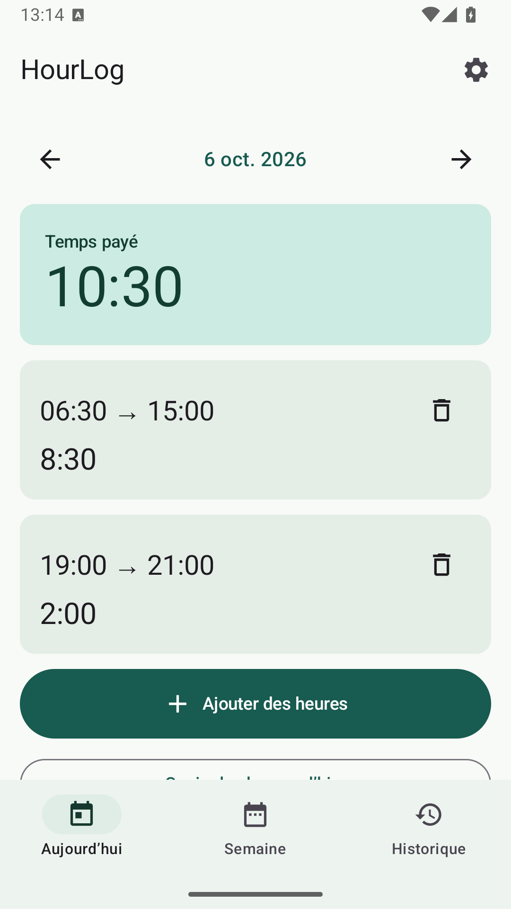
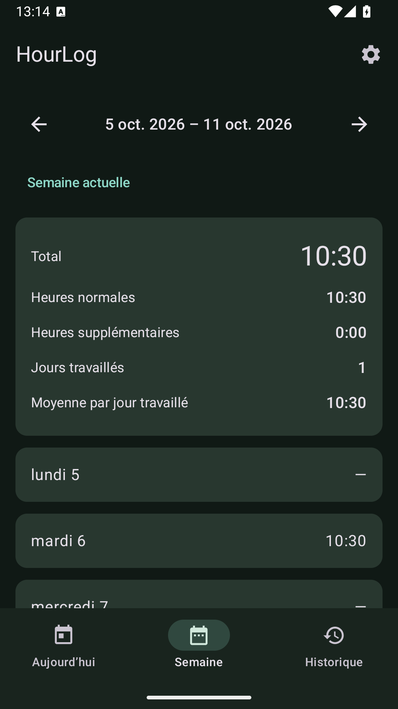

# HourLog

An offline Android app for recording work periods, paid and unpaid breaks, weekly overtime and estimated gross pay. **App name:** HourLog · **Project:** HourLog · **Application ID:** `com.hourlog.app`.

Built with Kotlin, Jetpack Compose, Material 3, Room, ViewModel, DataStore and WorkManager. Android 8.0 / API 26 or newer. English and French follow the phone language.

## Features

- Multiple periods per day, editing past entries, notes, confirmed deletion and explicit overlap approval.
- Start and end dates for overnight and multi-day periods; precise elapsed time across daylight saving transitions.
- Multiple paid/unpaid breaks; paid is the initial default, with unpaid and “ask each time” preferences.
- Today, Monday–Sunday week summaries, recorded-week history and a monthly calendar.
- Copy the previous day with new IDs, validation and overlap confirmation.
- Configurable weekly overtime threshold (initially 40 hours), multiplier (1.5×), hourly rate and ISO currency (CAD initially).
- Hours/minutes or localized decimal display; immediately applied and automatically saved light/dark/system appearance, five named accent presets and custom hex colors.
- Optional custom PIN/password or system biometric/device credential lock, custom background delay, and protected capture while locked.
- Manual GitHub update checking, verified APK downloads and Android installation confirmation; Obtainium shortcut.
- Adaptive launcher icon with a full green background.
- Optional weekly reminder, disabled initially with no day/time preselected; choose a schedule to open the current week.
- Detailed CSV, weekly CSV and paginated PDF for a week, several weeks or any date range.
- Android document picker for saving, Android share sheet for sharing, and validated/versioned JSON backup and restore.

XLSX is deliberately omitted: UTF-8 CSV opens in Excel, Sheets, LibreOffice and Numbers. Periodic automatic backup and a manual in-app language override are optional future extensions; all current backup/export actions are manual.

In Settings, appearance and valid colors are saved as soon as you select them. **System** follows the phone’s light/dark mode; the chosen theme also covers the lock screen and Android bar icons. Custom colors accept six hexadecimal digits with or without `#`; invalid input leaves the last valid color applied. Restore default colors immediately returns to the original green. Other editable settings, such as pay and reminders, still use **Save**.

## Screenshots

Screenshots use synthetic data only. See [docs/screenshots](docs/screenshots) for English/French and light/dark versions.


 

## Requirements

- JDK 17.
- Android SDK platform 36 and build-tools 36.0.0, plus platform-tools for device installation.
- Android Studio supporting Android Gradle Plugin 9.1, or the included Gradle 9.3.1 wrapper.
- Network access for the first dependency download. Recording, calculations and exports work offline; checking/downloading updates connects to GitHub only when requested.

Open this folder in Android Studio. Let it create `local.properties`, or add `sdk.dir=/your/android/sdk` to that ignored file. Set `JAVA_HOME` to a JDK 17 installation when building from the terminal.

## Build, test and APKs

```sh
./gradlew :app:assembleDebug
./gradlew :app:testDebugUnitTest :app:lintDebug
# A running emulator or connected phone is needed for instrumentation tests:
./gradlew :app:connectedDebugAndroidTest
./gradlew :app:assembleRelease
```

Generated files:

| Variant | Output | Signing |
|---|---|---|
| Debug | `app/build/outputs/apk/debug/app-debug.apk` | Android development key; directly installable |
| Release, no signing environment | `app/build/outputs/apk/release/app-release-unsigned.apk` | Must be signed before installation |
| Release, configured signing | `app/build/outputs/apk/release/app-release.apk` | Your supplied key |

Unit test reports: `app/build/reports/tests/testDebugUnitTest/index.html`. Lint: `app/build/reports/lint-results-debug.html`. Instrumentation reports from Gradle: `app/build/reports/androidTests/connected/debug/index.html`.

### Release signing

**Published 1.1.0–1.2.2 builds retain the original local development certificate to update the existing 1.0.0 installation without uninstalling or losing data.** The signing key is not in GitHub or CI. Preserve that exact key for future updates; a newly generated key cannot replace an installed APK. This distribution is development-signed, not a Play Store release.

For a separate fresh installation/distribution, generate a private signing key locally, outside the repository. `keytool` asks for passwords interactively:

```sh
keytool -genkeypair -v -keystore /secure/path/hourlog-release.jks \
  -alias hourlog -keyalg RSA -keysize 3072 -validity 10000
```

Set `HOURLOG_KEYSTORE` to that absolute path and `HOURLOG_KEY_ALIAS` to `hourlog`. Supply `HOURLOG_STORE_PASSWORD` and `HOURLOG_KEY_PASSWORD` through your local environment or a CI secrets manager, then run `./gradlew :app:assembleRelease`. All four must be present. Keep the key and its passwords private and backed up: updates require the same key. Never commit a key, password or private backup.

The release build uses R8 optimization. It is unsigned when signing is not configured; it never silently uses the development key. For manual signing, use Android SDK `zipalign` and `apksigner`, or Android Studio’s **Generate Signed Bundle / APK**.

### Install on a phone

1. Copy the debug or signed release APK to the phone and open it. Allow installation from that file manager when Android asks.
2. Alternatively enable Developer options / USB debugging, authorize the computer, then run:

```sh
adb devices
adb install -r app/build/outputs/apk/debug/app-debug.apk
```

A release signed with another key cannot replace a debug install. Export a backup before uninstalling to switch signing keys; uninstalling deletes local data.

A French setup guide is available in [docs/INSTALLATION.fr.md](docs/INSTALLATION.fr.md).

## Time and pay rules

All period boundaries are stored as UTC epoch seconds with their original IANA time zone and start date. Entry resolution is minute based; durations and thresholds use exact integer minutes. **The entire period belongs to its start date**, even when it crosses midnight or Sunday into Monday. An intentional overlap counts both periods and is flagged in the UI and detailed CSV.

Daylight saving gaps are rejected with a clear message. Repeated times offer both UTC offsets. Elapsed time follows actual instants, so 01:00–04:00 during a spring-forward transition may represent two hours. Copying a day refuses a destination in a missing/repeated time; enter those times manually.

Break durations cannot exceed the period. Paid breaks are included; unpaid breaks are deducted. Weekly overtime applies after the configured number of paid minutes, allocating periods in chronological order, then by ID for ties. It resets each Monday. A partial export still uses all recorded entries in the full week to determine which selected minutes are overtime.

Money uses `BigDecimal`; display uses the selected ISO currency and phone locale. Both display and weekly CSV gross-pay totals use the currency's fraction digits (for example, zero for JPY and three for KWD), with half-up rounding. Hourly rate and multiplier support up to four decimal places. The initial rate is zero until the user enters it. Decimal hour display rounds to two digits; internal totals remain exact. 7 h 45 displays as 7.75, not 7.45.

**Pay is a configurable estimate before deductions, not a payroll rules engine. Current settings apply to every historical week.** Historical rate schedules, daily overtime, tax calculations and employer-specific legal rules are outside this version.

## Storage and architecture

```text
Compose screens → HourLogViewModel → HourRepository
                                   ├─ Room: work_entries, break_entries, preference_recovery
                                   ├─ DataStore: user preferences
                                   └─ pure domain calculators / JSON + CSV / Android PDF
WorkManager → repository snapshot → Android notification
```

- `domain/`: time, break, overlap, overtime and pay calculations; independent of Android UI/storage.
- `data/`: Room entities/DAO, repository transactions, DataStore preferences.
- `ui/`: Compose screens, Material input dialogs, ViewModel and document-picker contracts.
- `export/`: JSON codec, CSV generation, Android `PdfDocument` reports.
- `notifications/`: persisted WorkManager scheduling and time-zone/time-change rescheduling.
- `security/`: device-bound credentials, cooldown and lock session.
- `updates/`: bounded GitHub downloads, checksums, package/version/signature checks.

The first Room schema is committed under `app/schemas/`. Future database changes must increment the version and supply tested migrations; destructive fallback is not enabled.

### Backup format and restoration

JSON identifies `application: "HourLog"`, `version: 1`, a UTC creation timestamp, preferences and all entries/breaks. Monetary values are decimal strings, durations integer minutes and dates ISO 8601. Entry IDs and break IDs are preserved. The importer checks format/version, size, unique IDs, zones, dates, durations, breaks and preferences **before showing the confirmation**. Unsupported future versions are rejected without modifying current data. Add an explicit codec migration before accepting a new version.

Restoring replaces all periods, breaks and preferences. Room replaces entries and writes a preference recovery record in one transaction; DataStore is then synchronized. The recovery record remains authoritative until synchronization succeeds, including after a process interruption. Startup finishes pending preference recovery. Cancelling the preview changes nothing.

Backup files are plain JSON. Protect them like other documents containing work and salary information. Version 1 backups now include an optional `reminderScheduleChosen` marker. Unselected schedule fields are day 0 and hour/minute -1; enabled reminders require a valid schedule. Older HourLog versions can reject backups containing those unselected fields, so use 1.2.0 or newer to restore a new backup. The backup export/import limit is 10 MiB. Backups are manual and can be placed in any user-selected document location. The app does not send them automatically.

### Exports

CSV uses a UTF-8 BOM, comma separator, quoted fields and CRLF records. Dates and decimal numbers have stable portable formats, while duration columns use exact minutes. Notes starting with spreadsheet formula markers receive a leading apostrophe. Select UTF-8/comma when a spreadsheet import dialog asks. PDF contains the chosen period, daily entries, breaks, totals, current pay settings and gross estimate; long notes wrap and reports paginate.

Files are prepared in the app cache, then saved using Android’s Storage Access Framework or shared with a temporary read grant through FileProvider. Export cache files can be removed by Android or by clearing cache.

## Notifications and permissions

Reminders are initially disabled so the first launch does not request permission. Enable the reminder and save settings to request `POST_NOTIFICATIONS` on Android 13+. Choose the day and time before enabling and saving a reminder; there is no preselected schedule. Existing enabled reminders survive the 1.2.0 upgrade. The former disabled Friday 15:30 placeholder is cleared, while customized disabled schedules are kept. The notification channel can also be disabled in Android settings.

WorkManager persists scheduled work through process exit and reboot. It calculates the next local calendar occurrence each time and reschedules after system time/time-zone changes. Reminder delivery is **best effort**, not an exact alarm: Doze, battery restrictions, OEM policies or a powered-off phone can delay it. Missed reminders from an earlier date are skipped. Android force-stop prevents background work until the app is opened again. The app requests no exact-alarm permission.

The merged manifest includes WorkManager’s wake-lock, network-state, foreground-service and boot-receiver permissions used by its scheduling infrastructure. Network-state permission does not provide Internet access. Document access is granted for the chosen URI only; no broad storage permission is requested.

## Privacy

- All time entries, notes and salary settings remain on the device.
- No account, ads, analytics or telemetry. No work entries are uploaded by the updater.
- `INTERNET` is used only for explicitly requested GitHub update checks/downloads. GitHub receives the connection metadata such as IP address and version User-Agent.
- `USE_BIOMETRIC` enables Android authentication; the app never reads biometric templates or the phone PIN.
- `REQUEST_INSTALL_PACKAGES` enables the optional update installer. Android asks for permission and installation confirmation.
- Automatic Android app-data cloud backup is disabled.
- Export/backup/share actions are initiated manually. The chosen document provider or sharing app decides where the resulting file goes.
- No personal data or signing secrets belong in this repository.

### App lock

Choose a 6–12 digit PIN, an 8–128 character password, or Android biometric/device authentication in Settings → Protection. A custom credential can optionally use the phone credential as a fallback. Android 11+ uses the system biometric prompt; Android 8–10 uses device credential confirmation. Biometrics depend on enrolled, supported hardware. Enter a custom delay in seconds, minutes or hours (up to 24 hours); 0 locks immediately. Background expiry locks the session; a cold process always starts locked. Changing the delay can retain the existing PIN/password, with the current credential required.

Custom credentials use salted PBKDF2-HMAC-SHA256 (210,000 iterations); the verifier and settings are AES-GCM encrypted with an Android Keystore key. Five wrong attempts trigger a persistent cooldown, increasing up to 15 minutes. Changes/removal require the existing credential. The locked screen and credential-entry dialogs block screenshots/recents captures. Once unlocked, previews, screenshots and screen search are allowed; Circle to Search availability depends on the phone. Reminders omit totals whenever an app lock is configured.

This protects access through the app UI. The Room database remains in Android private app storage and is **not separately encrypted by this feature**. Manual exported JSON/CSV/PDF files are plain documents and need their own protection. Lock settings and verifiers are excluded from HourLog backups; restoring time data does not disable the device lock. There is no remote reset: retain your credential, enable phone fallback if desired, and keep private backups. Clearing app data/uninstalling erases entries.

### Updates and Obtainium

Install [the latest APK](https://github.com/ares-projects-H/HourLog/releases/latest) over the previous version. From 1.1.0 onward use Settings → Updates → Check for updates, then download/install. The confirmation dialog has a persistent “Do not show this message again” checkbox; checking it and continuing skips future notices. Cancelling does not save that choice. A button can restore the confirmation. Nothing checks in the background. Downloads require a matching SHA-256 from the release, the same package and signing certificate, and a higher version code. Android performs the final installation and preserves app data. Allow installation from HourLog if prompted, then tap Install again.

Alternatively add `https://github.com/ares-projects-H/HourLog` to [Obtainium](https://github.com/ImranR98/Obtainium), or use the in-app shortcut. Each stable GitHub release has one installable `HourLog-vX.Y.Z.apk` and `SHA256SUMS`. See [maintainer release instructions](docs/RELEASING.md).

## Validation

See [docs/VALIDATION.md](docs/VALIDATION.md) for the checks actually performed on this delivery, including emulator results and device-only limitations. Business tests cover the required eight examples, multiple/mixed breaks, overlaps, Monday–Sunday totals, thresholds, multiplier, currency arithmetic, decimal locale, DST, copying, reminder recurrence, JSON round trips and partial-week CSV allocation. Instrumentation tests cover entry flows, deletion approval, Room reopening, restore validation/recovery, PDFs and a real notification.

## Contributing

Read [CONTRIBUTING.md](CONTRIBUTING.md). Preserve offline operation, exact time/money arithmetic, localized resource strings, explicit deletion/overlap/restore confirmation and tested schema migrations. Report problems with synthetic examples rather than private exports.

## License

MIT. See [LICENSE](LICENSE).

---

Designed, tested, and maintained by a human, with substantial development assistance from OpenAI Codex.
